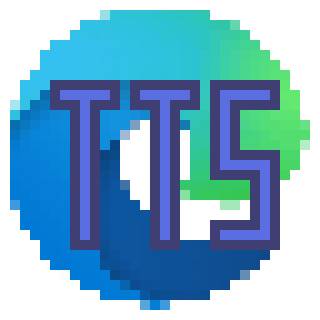

# EdgeTTS.Net

Fork来自 https://github.com/Loskh/EdgeTTS.Net

本Fork版本支持.Net Framework



## 如何使用

```C#
var etts = new EdgeTTSClient();
var result = etts.SynthesisAsync("这是一个测试", "zh-CN-XiaoyiNeural").Result;
if (ms.Code != ResultCode.Success)
{
    Console.WriteLine("生成失败");
    return;
}
var path = "test.mp3";
FileStream fs = new FileStream(path, FileMode.OpenOrCreate);
BinaryWriter w = new BinaryWriter(fs);
w.Write(result.Data.ToArray());
fs.Close();
w.Dispose();
fs.Dispose();
//Path 是生成的tts文件
```

